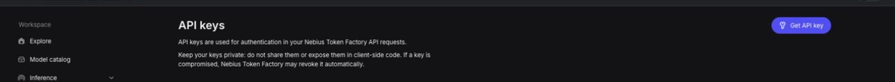
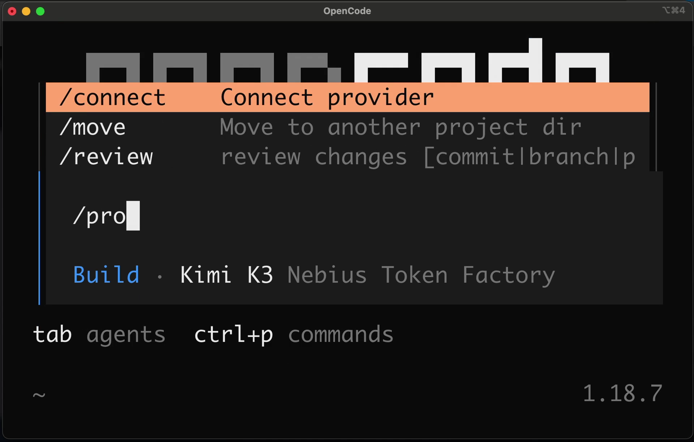
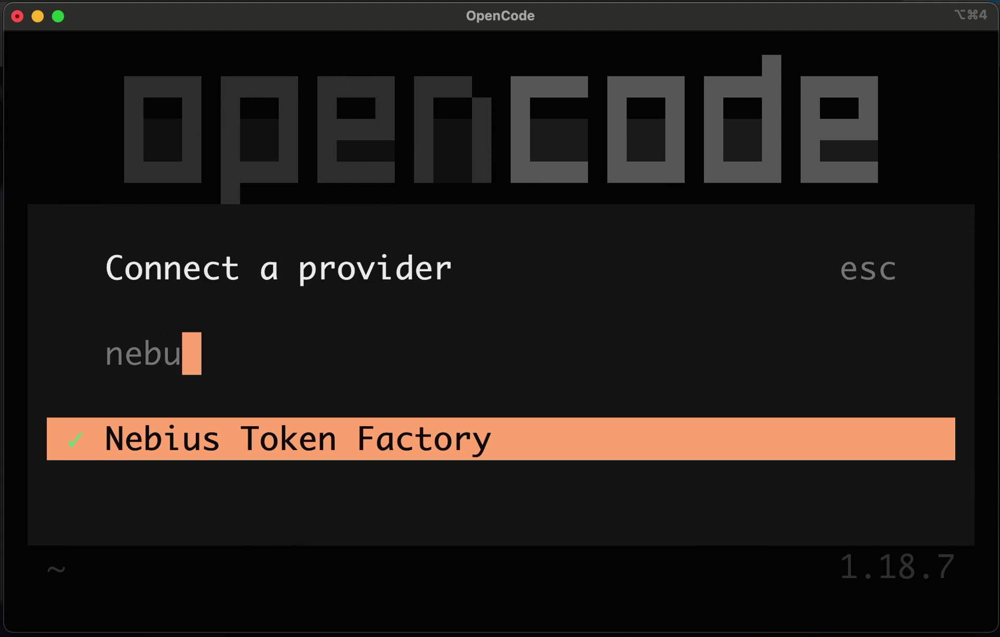
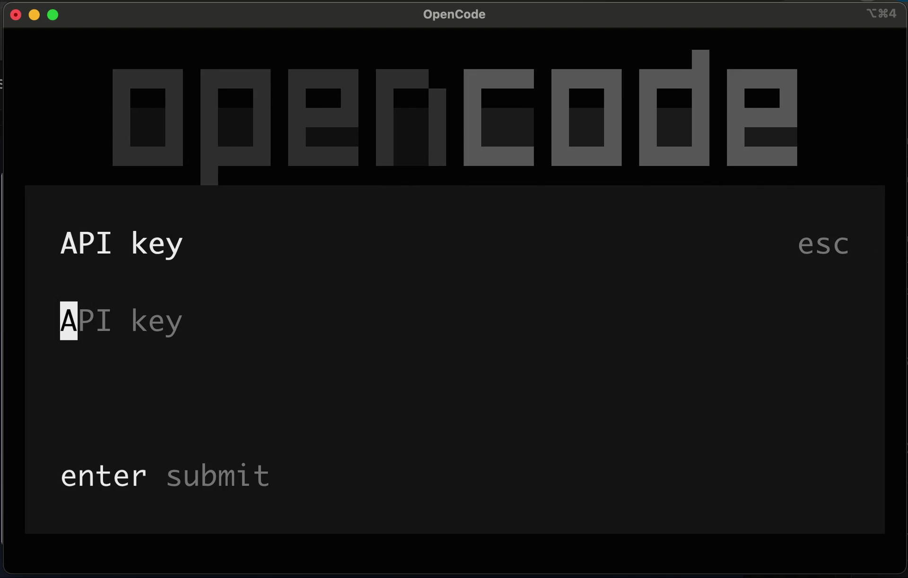
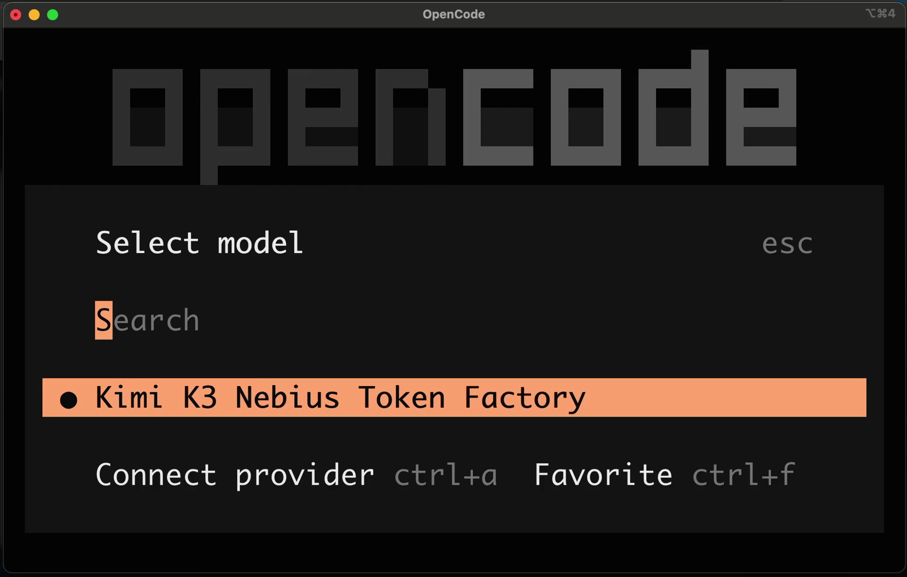
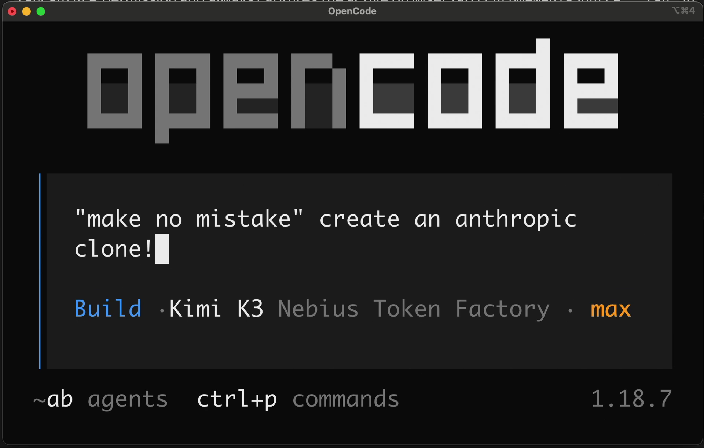

# How to use OpenCode with Nebius Token Factory models

[OpenCode](https://opencode.ai/) is a coding agent that lives in your terminal, and Nebius Token Factory is one of the providers built into it. There is no gateway to configure and no base URL to paste: run `/connect`, pick **Nebius Token Factory**, paste an API key once, and every Token Factory model you have access to shows up in the model picker.

This guide covers the one-time setup, then spends a real prompt through it so you can see what an agent run actually costs.

> For the short version — including the custom-provider and proxy options — see the [OpenCode integration guide](opencode.md).

## What you need

- [OpenCode](https://opencode.ai/docs/) installed and on your `PATH`
- A [Nebius Token Factory](https://tokenfactory.nebius.com/) account — see [Getting Started](../getting-started.md)
- About five minutes for setup, and roughly $0.76 if you run the example prompt on GLM-5.2

## 1. Create a Token Factory API key

In [Token Factory](https://tokenfactory.nebius.com/), select the project you want to bill against, open **API keys**, and select **Get API key**. Copy the key — you will paste it into OpenCode in the next step, and Token Factory will not show it again.



Treat the key like a password. It authorizes paid inference against that project.

## 2. Connect Token Factory in OpenCode

Start an interactive session from the directory you want to work in:

```bash
opencode
```

Run `/connect`.



Type `nebu` to filter the provider list, then select **Nebius Token Factory**.



Paste the API key and press enter.



OpenCode stores the credential locally — on macOS and Linux in `~/.local/share/opencode/auth.json` — so this is a one-time step per machine, not per project. The full flow is recorded in [the OpenCode walkthrough](https://github.com/amrrs/opencode-nebiustf-cookbook/blob/main/media/opencode-kimi-k3.mp4).

## 3. Pick a Token Factory model

Run `/models` and search for the model you want.



OpenCode model identifiers are `nebius/<vendor>/<model>` — the Token Factory model ID with the provider prefix in front:

| Model | OpenCode identifier | Context | Input / output per 1M tokens |
| --- | --- | ---: | ---: |
| Kimi K3 | `nebius/moonshotai/Kimi-K3` | 1M | $3.00 / $15.00 |
| GLM-5.2 | `nebius/zai-org/GLM-5.2` | 1M | $1.40 / $4.40 |
| MiniMax-M3 | `nebius/MiniMaxAI/MiniMax-M3` | 1M | $0.30 / $1.20 |
| Llama 3.3 70B Instruct | `nebius/meta-llama/Llama-3.3-70B-Instruct` | 128K | $0.13 / $0.40 |

Model IDs, context limits, and prices above were checked on August 28, 2026. They change, so confirm yours in the [Token Factory model catalog](https://tokenfactory.nebius.com/models/catalog) and on the [pricing page](https://tokenfactory.nebius.com/pricing).

Two things worth knowing before you spend anything:

- **The model list is per account.** OpenCode shows what the provider publishes; whether a specific model answers depends on your account's access.
- **Pick for the job, not for the headline.** An agent loop resends its accumulated context on every step, so input tokens dominate the bill. A mid-priced model that finishes in ten steps is often cheaper than a premium one that finishes in eight.

If a brand-new model has not made it into the built-in catalog yet, you can still reach it by defining a custom provider — see [Option 2 in the OpenCode integration guide](opencode.md#option-2-add-a-custom-provider).

## 4. Give it real work

Setup means nothing until the model builds something. Paste the prompt below into the session and let the agent work.



The prompt asks for a single-page, dependency-free token cost calculator: one self-contained `index.html`, live results, real `<label>` elements, an `aria-live` results region, validation that never renders `NaN`, and a `README.md` documenting the formula. It is deliberately small and fully checkable by eye — the point is to watch a Token Factory model drive an agent loop end to end, not to build something large.

<details>
<summary>The full prompt (also in <a href="assets/opencode/prompt.md">assets/opencode/prompt.md</a>)</summary>

```text
Build a single-page token cost calculator for Nebius Token Factory models as one
self-contained `index.html` file. No build step, no frameworks, no bundler, and no
network requests at runtime — opening the file with `file://` must be enough.

Requirements:

- Inputs for model ID, input price per 1M tokens, output price per 1M tokens, input
  tokens per run, output tokens per run, and number of runs.
- Live results that recompute on every input change: input cost per run, output cost
  per run, total cost per run, and projected cost for all runs, each shown in USD with
  four decimal places.
- Seed the form with `moonshotai/Kimi-K3` at $3.00 input and $15.00 output per 1M tokens.
- A preset list of at least three Token Factory models that fills the form when a preset
  is chosen, with the pricing date stated in the page as an "as of" note.
- Validation that rejects negative and non-numeric values with an inline message next to
  the offending field, never rendering `NaN`.
- Plain CSS only, readable at both 375px and 1280px widths, and accessible: every input
  has a real `<label>`, and results update through an `aria-live` region.
- Keep the page under 400 lines and add a top-of-file comment block explaining the cost
  formula.

Also write a `README.md` that states how to open the page, the exact cost formula used,
that prices are user-supplied rather than fetched, and where to check current Token
Factory pricing.
```

</details>

You can also run it non-interactively, which is how the cost below was measured:

```bash
opencode run --model nebius/zai-org/GLM-5.2 --auto "$(cat prompt.md)"
```

`--auto` approves file writes without prompting. Use it in a scratch directory, not in a repository you care about.

## 5. What one run costs

One non-interactive run of that prompt on GLM-5.2, measured on August 28, 2026 with opencode 1.18.21:

| Metric | Value |
| --- | --- |
| Assistant turns | 21 |
| Input tokens | 483,125 |
| Output tokens | 9,830 (plus 9,576 reasoning tokens) |
| Wall time | 128s |
| Cost reported by OpenCode | $0.7618 |

The shape of that bill is the lesson. Output is tiny — a 200-line HTML file and a README — while input is nearly half a million tokens, because each of the 21 steps resent the whole conversation plus tool output. Reasoning tokens are reported as a detail inside output usage and are billed at the output rate, so count them once.

Your number will differ. Agent runs are not deterministic, and anything that adds to the system prompt on your machine — installed skills, plugins, `AGENTS.md` files, MCP servers — is resent on every step and shows up as input tokens.

The generated app and the full run notes are in the [companion repository](https://github.com/amrrs/opencode-nebiustf-cookbook).

## Verify the setup

- `/models` lists models under **Nebius Token Factory**.
- A prompt gets a reply, and the footer shows the Token Factory model you selected.
- Token Factory's usage view for that project shows requests appearing as you work.

To confirm which models your key can actually reach, ask the API directly:

```bash
curl -s https://api.tokenfactory.nebius.com/v1/models \
  -H "Authorization: Bearer $NEBIUS_API_KEY" | python3 -m json.tool
```

## Troubleshooting

**Nebius Token Factory is missing from `/connect`.** Update OpenCode and restart it. The provider list ships with the release.

**A model is missing from `/models`.** Compare the picker against the `curl` output above. If the API lists it and OpenCode does not, update OpenCode; if neither lists it, your account does not have access.

**A run hangs with no output at all.** OpenCode waits on the first token, so a model that never sends one looks like a frozen agent. Test it outside OpenCode:

```bash
curl -s -m 60 https://api.tokenfactory.nebius.com/v1/chat/completions \
  -H "Authorization: Bearer $NEBIUS_API_KEY" \
  -H 'Content-Type: application/json' \
  -d '{"model":"zai-org/GLM-5.2","messages":[{"role":"user","content":"Reply with exactly: PONG"}],"max_tokens":30}'
```

A healthy Token Factory model answers this in about a second. If that call also returns nothing before the timeout, the problem is upstream of OpenCode — switch models with `/models` and carry on in the same session. That is exactly why this guide's run used GLM-5.2: on the day it was written, one model on the account returned no first token for over 90 seconds while others answered immediately.

**401 or 403 on every request.** The key is revoked, mistyped, or belongs to a different project. Run `/connect` again and paste a fresh key.

## Keep the cost down

- Start a new session for unrelated work. Context carried from a finished task is resent as input tokens on every step.
- Switch models mid-session with `/models` — plan on a stronger model, execute on a cheaper one.
- Prune what loads into every prompt: unused skills, plugins, and MCP servers are pure input-token overhead.
- Give the agent a narrow, checkable task. Fewer steps is the single biggest lever on cost.

## Clean up

The demo prompt only writes files in the working directory, so deleting that directory removes everything it produced. To disconnect the provider, remove the `nebius` entry from `~/.local/share/opencode/auth.json`, and delete the API key in Token Factory if you no longer need it.

## Links

- [OpenCode documentation](https://opencode.ai/docs/)
- [OpenCode providers](https://opencode.ai/docs/providers)
- [Nebius Token Factory](https://tokenfactory.nebius.com/)
- [Token Factory model catalog](https://tokenfactory.nebius.com/models/catalog)
- [Token Factory documentation](https://docs.tokenfactory.nebius.com/)
