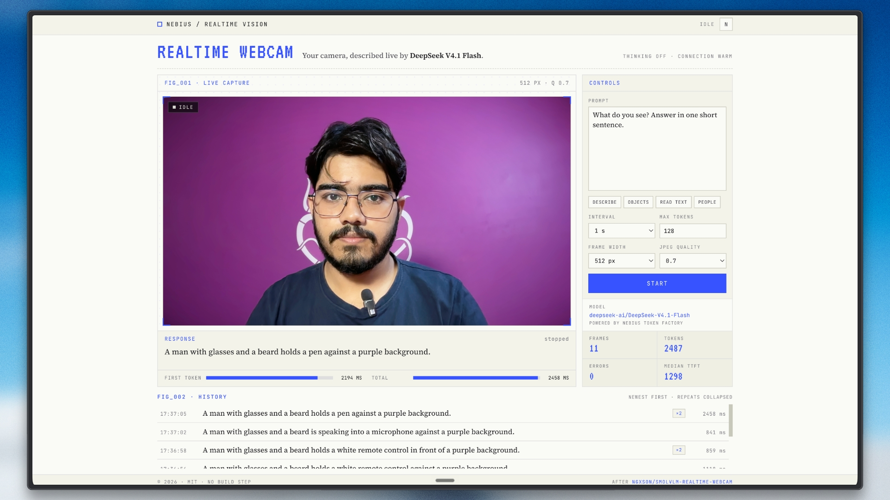

# Nebius Realtime Webcam

Point your webcam at something and get a running commentary from a vision model. It is exactly as
fun as it sounds, and it takes about thirty seconds to get going.

```bash
cp .env.example .env      # paste your key into NEBIUS_API_KEY
npm start                 # http://localhost:8080
```

No dependencies, no build step, no framework. Node 22.9+ and a browser with a camera.

Grab a key at [tokenfactory.nebius.com](https://tokenfactory.nebius.com) under **API keys**.

## Shout-out

This is a love letter to [**ngxson/smolvlm-realtime-webcam**](https://github.com/ngxson/smolvlm-realtime-webcam),
which had the original idea and the good taste to keep it tiny: grab a frame, POST it to an
OpenAI-compatible `/chat/completions` endpoint, show the answer, do it again. Go star it. This
version keeps the spirit and swaps the local `llama.cpp` server for a hosted one.

## The model

Everything here runs on `deepseek-ai/DeepSeek-V4.1-Flash`, pinned server-side. The browser cannot
change it, because the browser cannot be trusted with anything. If you want to point it somewhere
else, there is exactly one knob: `NEBIUS_MODEL` in `.env`.

### Thinking is switched off, on purpose

V4.1 Flash is a hybrid reasoner, which is wonderful for hard problems and terrible for a webcam
loop. Left alone it spends its entire `max_tokens` budget narrating its own thought process and
returns an empty `content`. The history fills up with `(empty response)` and you start questioning
your life choices.

So every request carries:

```js
{ reasoning_effort: 'none', chat_template_kwargs: { thinking: false } }
```

Different model families read different switches, so both go out. If the endpoint rejects them, the
server retries once without and remembers. Result: `reasoning_tokens: 0`, a complete sentence every
frame, and roughly half the latency.

### The connection is kept warm

Node hangs up on an idle HTTP/2 connection after about four seconds. At a 2s or 5s interval that
means nearly every frame re-does TCP and TLS before the model even sees your face. So the server
pings a token-free endpoint on a 2s timer while frames are flowing, and opens the connection at
startup so the first frame is not the slow one.

Measured at a 5s interval, interleaved, five runs each:

| | time to first token | total |
| --- | --- | --- |
| Connection kept warm | **1119 ms** | 1829 ms |
| Cold every frame | 1662 ms | 2165 ms |

Free speed. The ping costs no tokens.

### Things that sound like they should help but do not

Measured, so you do not have to:

- `detail: 'low'` does nothing. Flat 194 image tokens either way.
- Shrinking frames from 512px to 384px does nothing. Still 194 tokens.
- Lowering `max_tokens` does nothing for speed.

What is left is roughly 900ms of prefill and round trip that belongs to the endpoint, not to this
repo. Prompt wording trims the tail: ask for fewer words, get fewer output tokens, finish sooner.

## How it works

```
browser --frame (JPEG data URL)--> server.js --> /v1/chat/completions
        <------- token stream ----           <--
```

`server.js` exists for one reason: your API key stays server-side. The browser never sees it. It
also serves the frontend, so there is one process to run and one port to remember.

| Endpoint | Purpose |
| --- | --- |
| `GET /api/model` | The pinned model, and whether your account can serve it images |
| `POST /api/analyze` | `{ image, prompt, maxTokens }` returns an SSE stream of `{delta}` frames, closed by `{done, usage, finishReason, firstTokenMs, latencyMs}` |

### What is different from the original

- **The API key is proxied, not embedded.** The original talks to a keyless localhost server, which
  is fine right up until it is not.
- **One request in flight at a time.** The original uses `setInterval`, which quietly stacks
  requests whenever inference is slower than the tick, and against a hosted endpoint it usually is.
  Here the loop awaits each response, then waits the interval. "As fast as possible" means
  back-to-back, not on top of each other.
- **Answers stream in token by token,** with a blinking caret, because watching text appear is most
  of the fun. Stats report time to first token next to total latency.
- **Frames are downscaled before upload,** with resolution and JPEG quality exposed in the UI, since
  both drive image-token cost.
- **A history that collapses repeats** into a `xN` badge instead of fifty identical rows.
- **Prompt presets** for the usual party tricks: describe, objects as JSON, OCR, people counting.

## Cost

Every frame is a billed request and images cost input tokens. A 1-second interval is about 3,600
requests an hour, so this is not a thing to leave running overnight. Start at 512px, quality 0.7,
2s interval, and keep an eye on it.

## Configuration

| Variable | Default |
| --- | --- |
| `NEBIUS_API_KEY` | *(required)* |
| `NEBIUS_MODEL` | `deepseek-ai/DeepSeek-V4.1-Flash` |
| `NEBIUS_BASE_URL` | `https://api.tokenfactory.nebius.com/v1` |
| `PORT` | `8080` |

`getUserMedia` needs a secure context, so serve this over `localhost` or HTTPS. Point it at a
bookshelf, a whiteboard, or your cat, and enjoy.

## License

MIT
